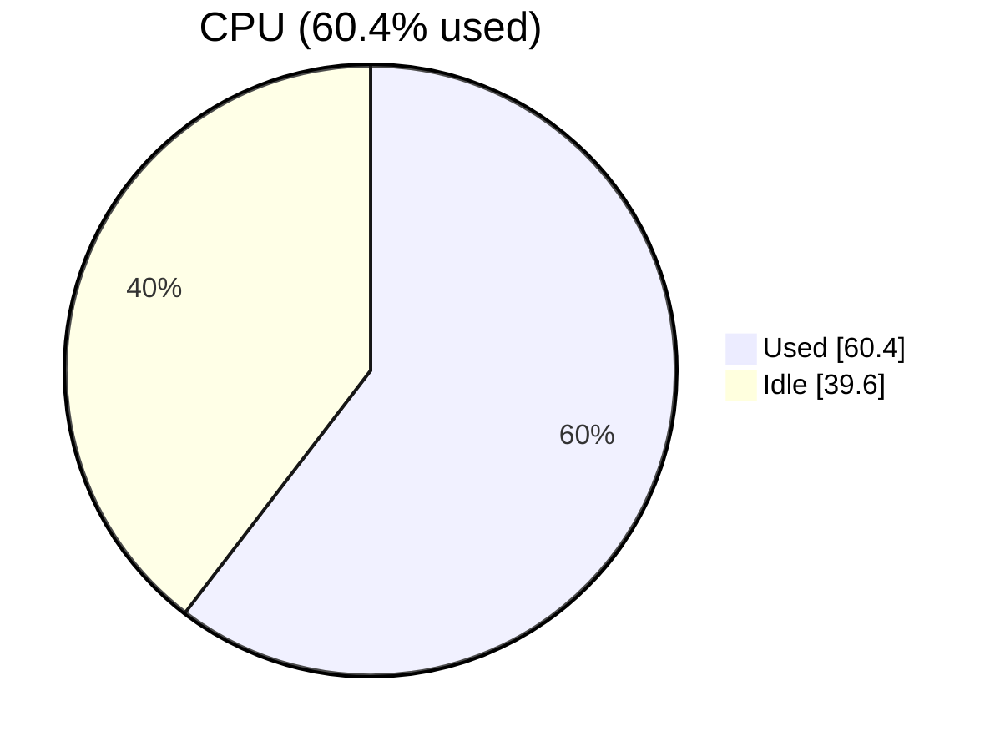
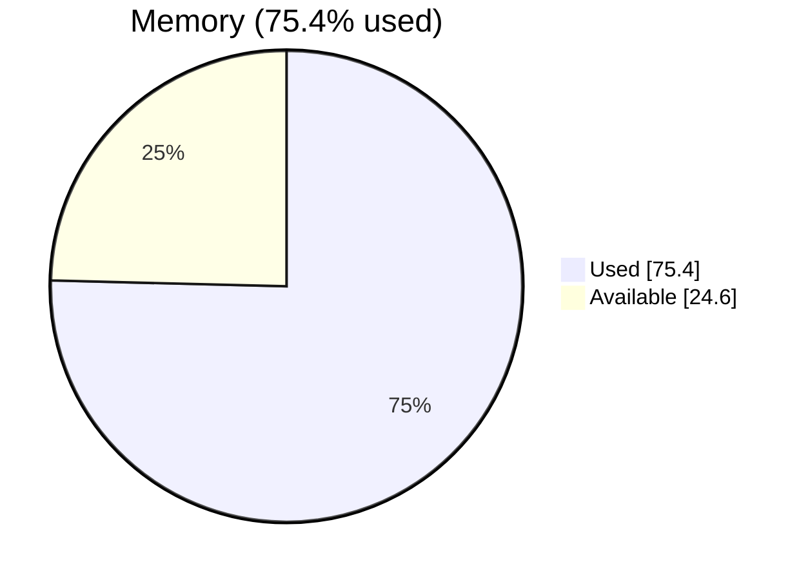

# 🖥️ Runner Telemetry Action

[](https://github.com/tsviz/actions-runner-telemetry/actions/workflows/telemetry-e2e.yml)
[](https://github.com/tsviz/actions-runner-telemetry/tags)
[](https://github.com/tsviz/actions-runner-telemetry#quick-start)

See what's actually happening in your GitHub Actions workflows. This action monitors CPU, memory, disk I/O, and processes—then shows you a detailed report right in your workflow summary. 

No more guessing if your job is using the runner efficiently. Just add one line and get instant visibility.


## What You Get

- 📈 **Real-time Metrics** - CPU, memory, disk I/O over time
- 📊 **Process Breakdown** - See exactly which processes eat resources (and what they do)
- 💰 **Cost Analysis** - Know if upgrading to a bigger runner actually saves money
- 🚀 **Runner Recommendations** - Get suggestions for 4-core and 8-core runners (if available on your plan)
- 📉 **Step-by-Step Breakdown** - Track which build step uses the most resources
- 🎯 **Health Grade** - A-D letter grade at a glance

## Real Report Examples

### Light Job (Underutilized)
When your job barely uses the runner:

```
🟢 Status: Healthy • Duration: 12.1s • Samples: 6

Quick Overview:
├─ CPU      🟢  8.6% current  15.1% peak   5.4% average
├─ Memory   🟢  5.4% current   5.7% peak   5.5% average
└─ Load     🟢  0.00 current   0.00 peak   0.00 average

I/O Summary:
├─ 📥 Disk Read:   71.1 KB  (5.9 KB/s)
├─ 📤 Disk Write: 142.3 KB (11.9 KB/s)
├─ 🌐 Network RX:  35.9 KB  (3.0 KB/s)
└─ 🌐 Network TX: 113.6 KB  (9.5 KB/s)

Utilization Score: D (11%) - Runner is significantly underutilized
```

### Heavy Job (Straining - With Live Charts)

When your job maxes out the runner and needs upgrading:

```
🔴 Status: Needs Attention • Duration: 43.6s • Samples: 21

Quick Overview:
├─ CPU      🔴  29.9% current  100.0% peak  60.4% average  
├─ Memory   🔴   8.4% current   95.6% peak  75.4% average
└─ Load     🟢   1.57 current   1.67 peak   1.22 average
```

**Resource Usage Over Time:**


**Average Resource Utilization:**

<table>
<tr>
<td>



</td>
<td>



</td>
</tr>
</table>

**Analysis:**
```
I/O Summary:
├─ 📥 Disk Read:   6.0 MB  (147.1 KB/s)
├─ 📤 Disk Write:  9.0 MB  (219.7 KB/s)
├─ 🌐 Network RX:  64.4 KB  (1.5 KB/s)
└─ 🌐 Network TX: 164.3 KB  (3.9 KB/s)

⚠️ RECOMMENDATION: Upgrade to Larger Runner
├─ CPU peaked at 100.0% (avg: 60.4%)
├─ Memory peaked at 95.6% (avg: 75.4%)
├─ Suggested: Linux 4-core (4x faster, same cost)
└─ Value: ~2.0x faster execution
```

All reports include:
- **Live interactive charts** (CPU/Memory trends, pie charts)
- **Process list** showing what's running
- **Cost analysis** with upgrade recommendations
- **Per-step breakdown** if you add step markers

📂 **[Browse more example reports →](examples/reports/README.md)**

## Quick Start

Add one step to any workflow:

```yaml
jobs:
  build:
    runs-on: ubuntu-latest
    steps:
      - uses: actions/checkout@v4
      
      - name: Monitor Runner
        uses: tsviz/actions-runner-telemetry@v1
      
      - name: Build
        run: npm run build
      
      - name: Test
        run: npm test
```

Done. The report appears in your workflow summary when the job finishes.

## Prerequisites

This action requires **Python 3.x** to be available on the runner.

✅ **Most GitHub-hosted runners** include Python by default—no extra setup needed.

⚠️ **Some runners may not have Python**, including:
- Windows ARM64 partner images
- Certain self-hosted runners
- Custom base images

If Python is missing, add `actions/setup-python` before this action:

```yaml
steps:
  - uses: actions/checkout@v4
  
  - uses: actions/setup-python@v5
    with:
      python-version: '3.11'
  
  - uses: tsviz/actions-runner-telemetry@v1
  
  # ... your build steps ...
```

## Real-World Usage

**"Why is my build slow?"**  
→ Check the Top Processes section. See if something's hogging CPU.

**"Should I pay for a bigger runner?"**  
→ Look at the cost analysis. It shows you the actual math—not guesses.

**"Why do I keep hitting timeouts?"**  
→ Check peak memory usage. If it's near 90%, you probably need more RAM.

**"Which build step is the bottleneck?"**  
→ Use per-step tracking to see CPU/memory per step.

## Installation

### Minimal (One-liner)

```yaml
- uses: tsviz/actions-runner-telemetry@v1
```

Runs in background and automatically generates the report at job completion.
No extra `mode: stop` step is required. The action includes a post step that
always runs at the end of the job (even on failures) to stop collection and write
the summary/dashboard.

### Full Control

```yaml
- name: Start monitoring
  uses: tsviz/actions-runner-telemetry@v1

# ... your build steps ...

- name: Generate report
  if: always()  # Runs even if steps fail
  uses: tsviz/actions-runner-telemetry@v1
  with:
    mode: stop
```

### With Per-Step Tracking

Want to know which step uses the most resources?

```yaml
steps:
  - uses: actions/checkout@v4
  
  - name: Start
    uses: tsviz/actions-runner-telemetry@v1

  - name: Mark - Install
    uses: tsviz/actions-runner-telemetry@v1
    with:
      mode: step
      step-name: "Install Dependencies"
  
  - name: Install
    run: npm ci
  
  - name: Mark - Build  
    uses: tsviz/actions-runner-telemetry@v1
    with:
      mode: step
      step-name: "Build"
  
  - name: Build
    run: npm run build
  
  - name: Mark - Test
    uses: tsviz/actions-runner-telemetry@v1
    with:
      mode: step
      step-name: "Test"
  
  - name: Test
    run: npm test
  
  - name: Stop
    if: always()
    uses: tsviz/actions-runner-telemetry@v1
    with:
      mode: stop
```

Now your report includes a per-step breakdown showing which step used the most CPU/memory.

## Options

| Option | Default | Notes |
|--------|---------|-------|
| `enabled` | `true` | Set to `false` to disable without removing the action |
| `mode` | `start` | `start`, `stop`, `step`, or `snapshot` |
| `interval` | `2` | Sample every N seconds |
| `step-name` | — | Name of the step (used with `mode: step`) |
| `upload-artifacts` | `false` | Set to `true` to upload telemetry files as artifacts |
| `artifact-name` | `runner-telemetry` | Name of the uploaded artifact |

### Modes Explained

- **`start`** - Begin monitoring (default)
- **`stop`** - Stop and generate the report
- **`step`** - Mark a step boundary 
- **`snapshot`** - Quick 10-second capture

## What Gets Measured

The report includes:

- **CPU Usage** - Current, peak, and average per-core utilization
- **Memory** - Current, peak, and average RAM usage
- **Load Average** - System load over 1/5/15 minutes
- **Disk I/O** - Read/write rates and total throughput
- **Network I/O** - RX/TX rates  
- **Processes** - Top 5 by CPU and memory, with descriptions
- **I/O Wait** - If the disk is bottlenecking
- **Swap Usage** - If you're running out of RAM
- **CPU Steal** - If the runner is oversubscribed

## Disable When Needed

```yaml
env:
  TELEMETRY_ON: false

- name: Monitor
  uses: tsviz/actions-runner-telemetry@v1
  with:
    enabled: ${{ env.TELEMETRY_ON }}
```

## Output Files

The action creates these files:

| File | What it contains |
|------|------------------|
| `telemetry-report.md` | Markdown report for the Job Summary |
| `telemetry-dashboard.html` | Interactive HTML dashboard artifact |
| `telemetry-raw.json` | All raw metrics data |
| `telemetry-samples.csv` | Time-series data for analysis |
| `telemetry-summary.json` | Flattened summary (dashboard-ready) |

### Upload as Artifacts (Recommended)

Use the built-in upload option:

```yaml
- uses: tsviz/actions-runner-telemetry@v1
  with:
    upload-artifacts: true
    artifact-name: my-job-telemetry  # optional, defaults to 'runner-telemetry'
```

This uploads all telemetry files as a GitHub artifact after the job completes.

### Manual Upload (Alternative)

If you need more control, use a separate upload step:

```yaml
- name: Upload report
  if: always()
  uses: actions/upload-artifact@v4
  with:
    name: runner-telemetry
    path: |
      telemetry-report.md
      telemetry-dashboard.html
      telemetry-raw.json
      telemetry-samples.csv
      telemetry-summary.json
```

> **Note:** The manual approach requires the upload step to run in a post-job hook
> or you must explicitly use `mode: stop` before uploading.

## Local Testing

```bash
docker build -t runner-telemetry-action .

docker run --rm \
  -v "$(pwd)/output:/github/workspace" \
  -e GITHUB_WORKSPACE="/github/workspace" \
  -e GITHUB_STEP_SUMMARY="/github/workspace/summary.md" \
  -e RUNNER_OS="Linux" \
  -e GITHUB_RUN_ID="12345" \
  runner-telemetry-action

cat output/telemetry-report.md
```

## FAQ

**Q: Does this slow down my workflow?**  
A: No. Sampling happens every 2 seconds in the background. Overhead is <1% CPU.

**Q: Is this only for Linux runners?**  
A: Works on Linux, macOS, and Windows runners. Metrics vary slightly by OS.

**Q: Can I use this on a self-hosted runner?**  
A: Yes. Works on any runner with Python 3.x installed. See [Prerequisites](#prerequisites).

**Q: Why would I upgrade to a bigger runner?**  
A: If your job uses >85% CPU/memory consistently, you'll hit timeouts. A bigger runner costs more per minute but jobs finish faster—and might be cheaper overall when you count developer time.

**Q: Where's the dashboard?**  
A: In your workflow summary tab (the one that shows job status). GitHub natively renders Markdown with charts.

## License

MIT
