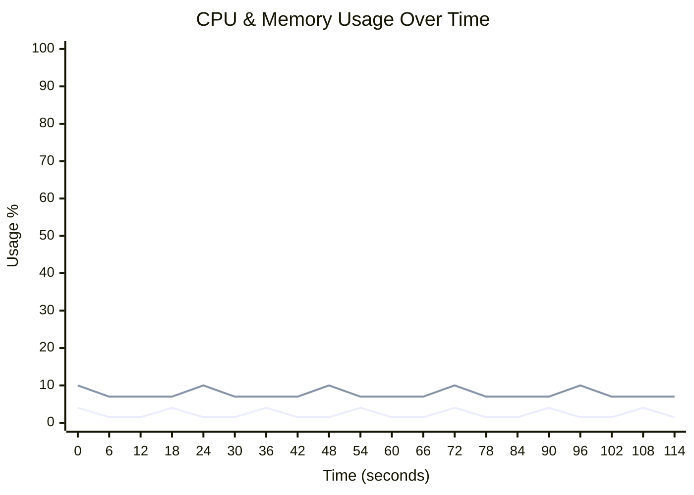
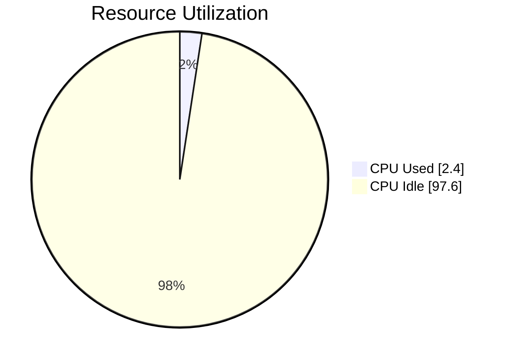
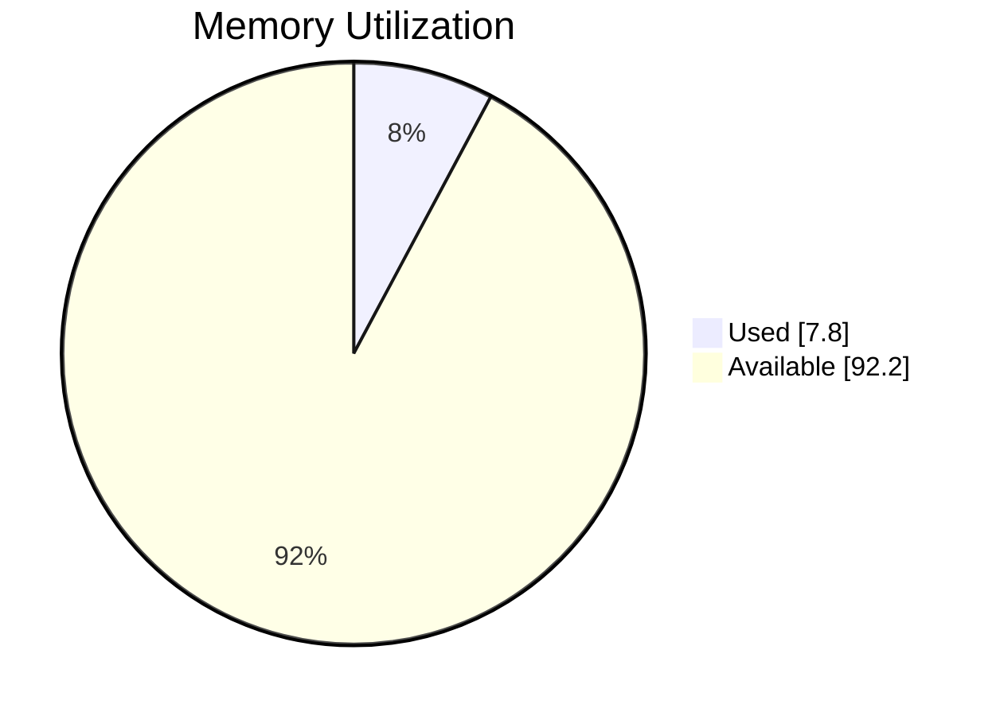

# 🖥️ Runner Telemetry Dashboard

> **🟢 Status: Healthy** • Duration: 2.0m • Samples: 20

---

## 📊 Quick Overview

| | Current | Peak | Average |
|:--|:-------:|:----:|:-------:|
| **CPU** 🟢 | 🟢 `░░░░░░░░░░░░░░░░░░░░` 1.5% | 4.0% | 2.4% |
| **Memory** 🟢 | 🟢 `█░░░░░░░░░░░░░░░░░░░` 7.0% | 10.0% | 7.8% |
| **Load** 🟢 | 0.50 | 0.50 | 0.50 |

---

## 📈 Resource Usage Over Time

| 🔵 CPU % | 🟢 Memory % |
|:--------:|:-----------:|
| Peak: 4.0% / Avg: 2.4% | Peak: 10.0% / Avg: 7.8% |

---

## 🔄 Average Resource Utilization

This shows the average CPU and memory usage during your job:

<table>
<tr>
<td width="50%">

**CPU Usage** - Average across all cores

</td>
<td width="50%">

**Memory Usage** - Average RAM consumption

</td>
</tr>
</table>

---

## ⚡ Performance Metrics

| Metric | Status | Peak | Average |
|:-------|:------:|:----:|:-------:|
| **I/O Wait** | 🟢 | 0.6% | 0.6% |
| **CPU Steal** | 🟢 | 0.2% | 0.2% |
| **Swap Usage** | 🟢 | 0.8% | 0.8% |

> ℹ️ Estimated baseline shown (no telemetry for I/O/CPU wait).

## 💾 I/O Summary

| Metric | Total | Avg Rate |
|:-------|------:|---------:|
| 📥 **Disk Read** | 120.0 MB | 1.0 MB/s |
| 📤 **Disk Write** | 84.0 MB | 716.8 KB/s |
| 🌐 **Network RX** | 96.0 MB | 819.2 KB/s |
| 🌐 **Network TX** | 60.0 MB | 512.0 KB/s |

> ℹ️ Estimated baseline shown (no I/O telemetry captured).

---

## 📋 Per-Step Analysis

| Step | Duration | Avg CPU | Max CPU | Avg Mem | Max Mem |
|:-----|:--------:|:-------:|:-------:|:-------:|:-------:|
| 🔥 Install Dependencies | 33.0s | 2.3% | 4.0% | 8.0% | 10.0% |
| Build Application | 33.0s | 2.3% | 4.0% | 7.5% | 10.0% |
| Run Tests | 53.0s | 2.3% | 4.0% | 7.7% | 10.0% |

> 💡 **Insights:** Longest step: **Run Tests** (53.0s) • 
> Heaviest CPU: **Install Dependencies** (2.3%)

---

## 💰 Runner Utilization & Cost Efficiency

> **Key Question:** Are you getting maximum value from your GitHub hosted runner?

### Utilization Score: D (6%)

🔴 Poor - Runner is significantly underutilized

`█░░░░░░░░░░░░░░░░░░░` **6.4%**

### 📊 What You're Paying For vs What You're Using

| Resource | Available | Peak Used | Avg Used |
|:---------|----------:|----------:|---------:|
| **CPU Cores** | 4 | 0.2 | 0.1 |
| **RAM** | 16.0 GB | 1.6 GB | 1.2 GB |

### 💵 Cost Analysis (Jan 2026+ Pricing)

> 📖 Pricing reference: [GitHub Actions Runner Pricing](https://docs.github.com/en/enterprise-cloud@latest/billing/reference/actions-runner-pricing)

| Metric | Value |
|:-------|------:|
| **Runner Type** | `Linux 4-core ARM Larger Runner` |
| **This Run** | $0.016 (2 min) |
| **Est. Monthly** (10 runs/day) | $4.80 |

> ⚡ **Performance Optimization: Parallelize Slow Steps**
>
> Step **"Install Dependencies"** uses only 2% CPU for 33s.
> Consider using matrix strategy to run parallel jobs - same cost, faster completion.

### ⏳ Idle Time Detected

**120s (100%)** of job time had minimal CPU activity.

Common causes:
- Waiting for package downloads (use caching)
- Sequential steps that could be parallelized
- Inefficient workflow design

### 🎯 Optimization Strategy

GitHub hosted runners are most useful when jobs finish quickly and resources match the workload:

**Priority: High Utilization Improvement**

- **Right-size workflow:** Already on the smallest tier? Focus on workflow efficiency over runner size.

- **Parallelize jobs:** Use matrix builds for independent steps  
- **Optimize caching:** Cache dependencies to reduce download time
- **Check for bottlenecks:** Identify and optimize slow sequential steps

With these optimizations, you can typically achieve 50-70% utilization and reduce costs by 30-50%.

---

## 🖥️ Runner Information

| Component | Details |
|:----------|:--------|
| **Runner** | linux-4-core-arm |
| **OS** | Linux |
| **Architecture** | ARM64 |
| **Total Memory** | 16,384 MB |
| **CPU Cores** | 4 |

---

> ✅ **All metrics within healthy thresholds**

---

Generated by [Runner Telemetry Action](https://github.com/tsviz/actions-runner-telemetry)
