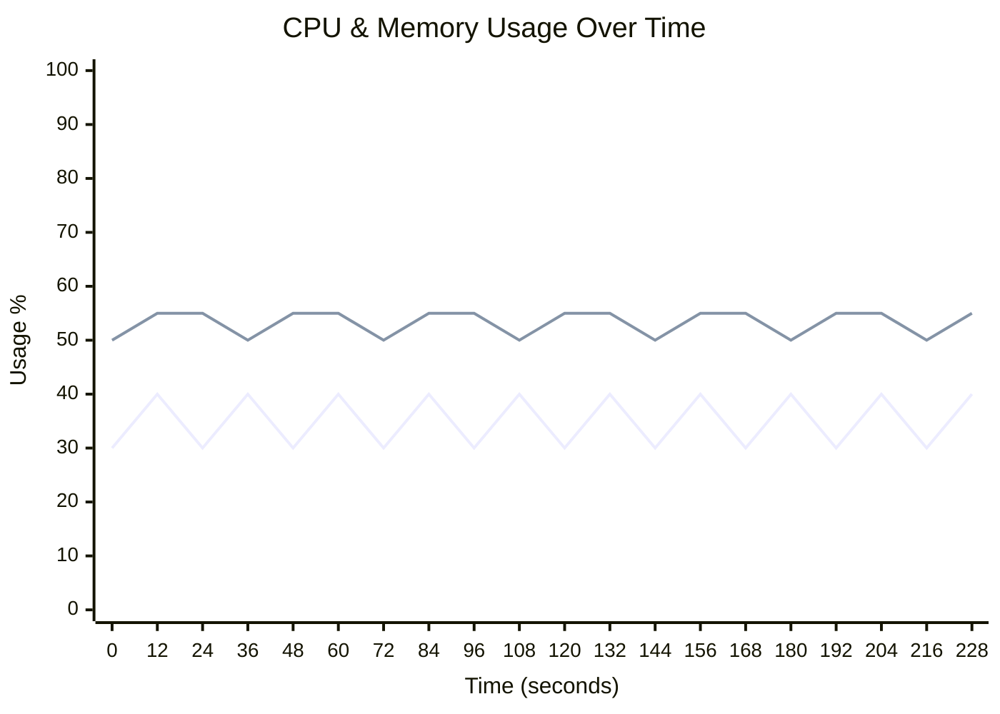
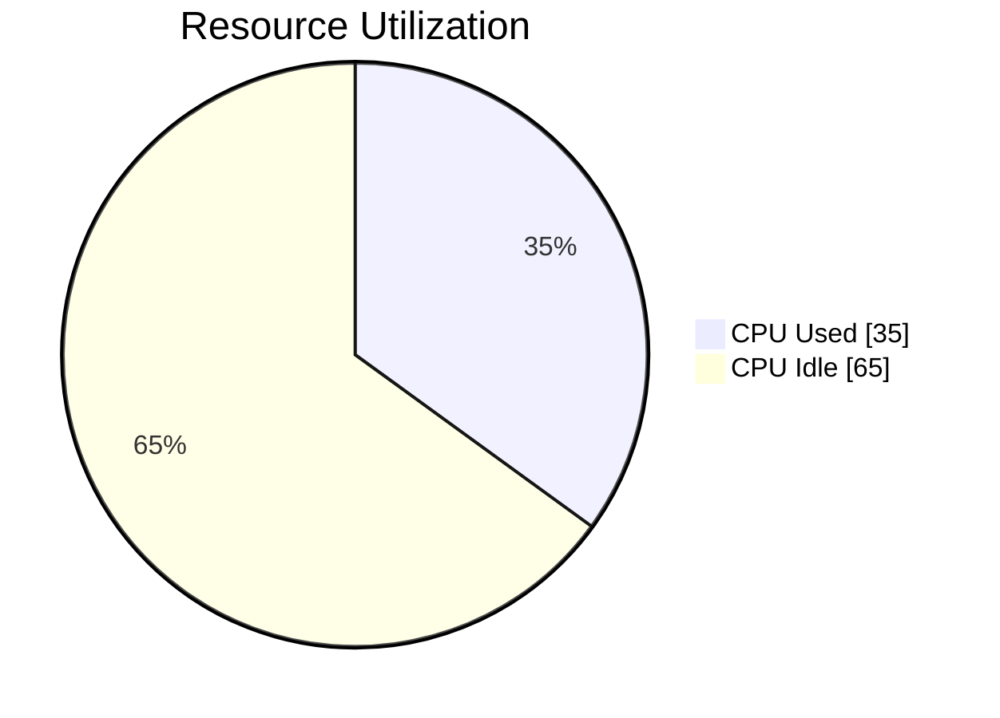
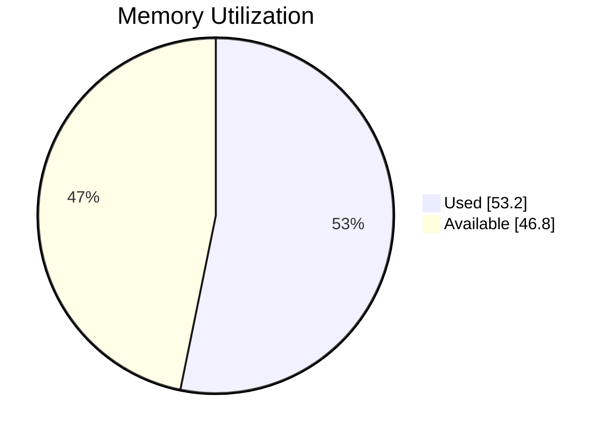

# 🖥️ Runner Telemetry Dashboard

> **🟢 Status: Healthy** • Duration: 4.0m • Samples: 20

---

## 📊 Quick Overview

| | Current | Peak | Average |
|:--|:-------:|:----:|:-------:|
| **CPU** 🟢 | 🟢 `████████░░░░░░░░░░░░` 40.0% | 40.0% | 35.0% |
| **Memory** 🟢 | 🟢 `███████████░░░░░░░░░` 55.0% | 55.0% | 53.2% |
| **Load** 🟢 | 0.50 | 0.50 | 0.50 |

---

## 📈 Resource Usage Over Time

| 🔵 CPU % | 🟢 Memory % |
|:--------:|:-----------:|
| Peak: 40.0% / Avg: 35.0% | Peak: 55.0% / Avg: 53.2% |

---

## 🔄 Average Resource Utilization

This shows the average CPU and memory usage during your job:

<table>
<tr>
<td width="50%">

**CPU Usage** - Average across all cores

</td>
<td width="50%">

**Memory Usage** - Average RAM consumption

</td>
</tr>
</table>

---

## ⚡ Performance Metrics

| Metric | Status | Peak | Average |
|:-------|:------:|:----:|:-------:|
| **I/O Wait** | 🟢 | 0.6% | 0.6% |
| **CPU Steal** | 🟢 | 0.2% | 0.2% |
| **Swap Usage** | 🟢 | 0.8% | 0.8% |

> ℹ️ Estimated baseline shown (no telemetry for I/O/CPU wait).

## 💾 I/O Summary

| Metric | Total | Avg Rate |
|:-------|------:|---------:|
| 📥 **Disk Read** | 2.3 GB | 10.0 MB/s |
| 📤 **Disk Write** | 1.7 GB | 7.2 MB/s |
| 🌐 **Network RX** | 0.0 B | 0.0 B/s |
| 🌐 **Network TX** | 0.0 B | 0.0 B/s |

---

## 📋 Per-Step Analysis

| Step | Duration | Avg CPU | Max CPU | Avg Mem | Max Mem |
|:-----|:--------:|:-------:|:-------:|:-------:|:-------:|
| Install Dependencies | 1.1m | 35.0% | 40.0% | 53.3% | 55.0% |
| Build Application | 1.1m | 35.0% | 40.0% | 53.3% | 55.0% |
| 🔥 Run Tests | 1.8m | 35.6% | 40.0% | 53.3% | 55.0% |

> 💡 **Insights:** Longest step: **Run Tests** (1.8m) • 
> Heaviest CPU: **Run Tests** (35.6%)

---

## 💰 Runner Utilization & Cost Efficiency

> **Key Question:** Are you getting maximum value from your GitHub hosted runner?

### Utilization Score: C (46%)

🟡 Fair - Good with room for improvement

`█████████░░░░░░░░░░░` **46.0%**

### 📊 What You're Paying For vs What You're Using

| Resource | Available | Peak Used | Avg Used |
|:---------|----------:|----------:|---------:|
| **CPU Cores** | 4 | 1.6 | 1.4 |
| **RAM** | 16.0 GB | 8.8 GB | 8.5 GB |

### 💵 Cost Analysis (Jan 2026+ Pricing)

> 📖 Pricing reference: [GitHub Actions Runner Pricing](https://docs.github.com/en/enterprise-cloud@latest/billing/reference/actions-runner-pricing)

| Metric | Value |
|:-------|------:|
| **Runner Type** | `Linux 4-core Larger Runner` |
| **This Run** | $0.048 (4 min) |
| **Est. Monthly** (10 runs/day) | $14.40 |

### 🎯 Optimization Strategy

GitHub hosted runners are most useful when jobs finish quickly and resources match the workload:

**Status: Good with Room for Improvement**

Current utilization (46%) is healthy. Next steps:
- Implement parallelization for slow steps
- Review caching strategies
- Monitor if you need a larger runner as usage grows

---

## 🖥️ Runner Information

| Component | Details |
|:----------|:--------|
| **Runner** | linux-4-core |
| **OS** | Linux |
| **Architecture** | X64 |
| **Total Memory** | 16,384 MB |
| **CPU Cores** | 4 |

---

> ✅ **All metrics within healthy thresholds**

---

Generated by [Runner Telemetry Action](https://github.com/tsviz/actions-runner-telemetry)
