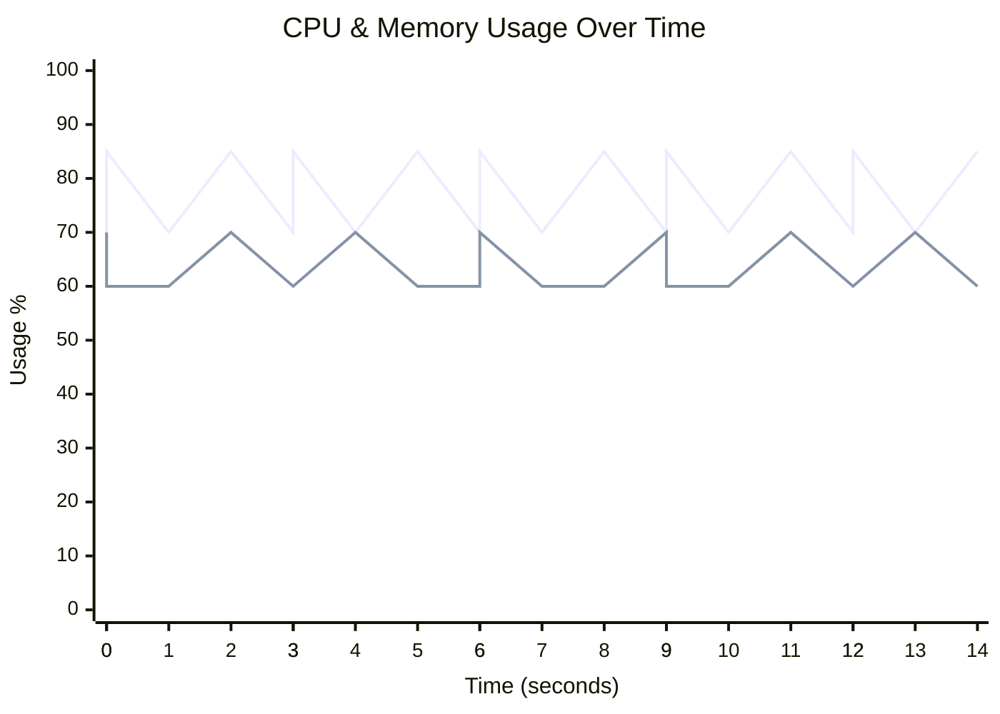
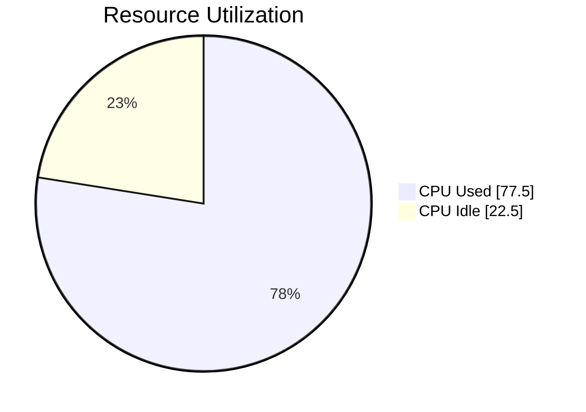
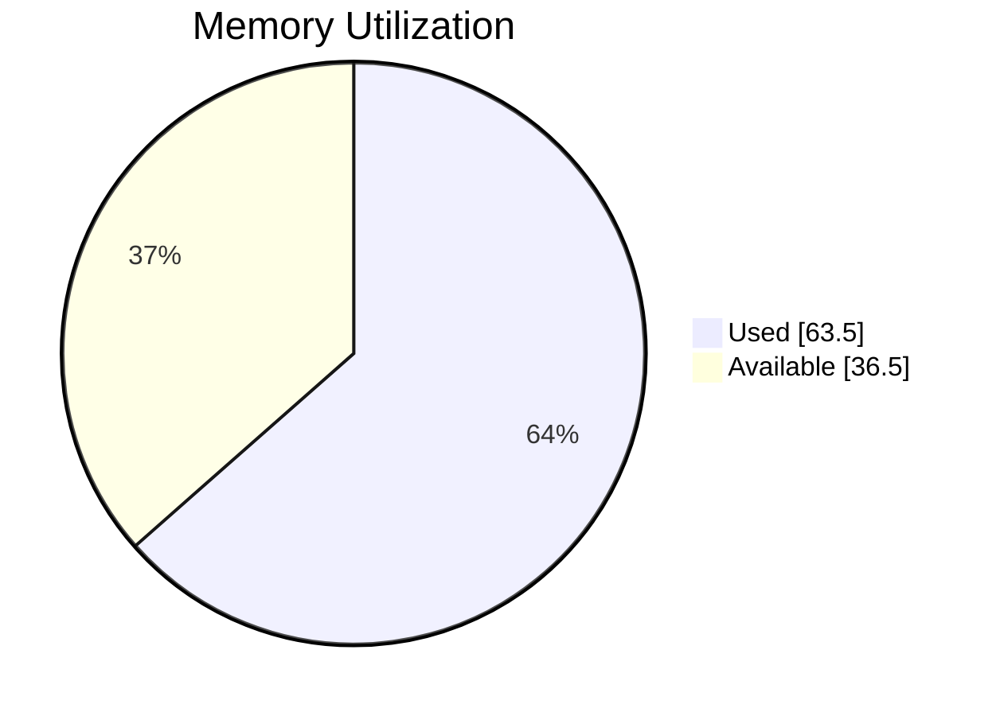

# 🖥️ Runner Telemetry Dashboard

> **🔴 Status: Needs Attention** • Duration: 15.0s • Samples: 20

---

## 📊 Quick Overview

| | Current | Peak | Average |
|:--|:-------:|:----:|:-------:|
| **CPU** 🔴 | 🔴 `█████████████████░░░` 85.0% | 85.0% | 77.5% |
| **Memory** 🟡 | 🟡 `████████████░░░░░░░░` 60.0% | 70.0% | 63.5% |
| **Load** 🟢 | 0.50 | 0.50 | 0.50 |

---

## 📈 Resource Usage Over Time

| 🔵 CPU % | 🟢 Memory % |
|:--------:|:-----------:|
| Peak: 85.0% / Avg: 77.5% | Peak: 70.0% / Avg: 63.5% |

---

## 🔄 Average Resource Utilization

This shows the average CPU and memory usage during your job:

<table>
<tr>
<td width="50%">

**CPU Usage** - Average across all cores

</td>
<td width="50%">

**Memory Usage** - Average RAM consumption

</td>
</tr>
</table>

---

## ⚡ Performance Metrics

| Metric | Status | Peak | Average |
|:-------|:------:|:----:|:-------:|
| **I/O Wait** | 🟢 | 0.6% | 0.6% |
| **CPU Steal** | 🟢 | 0.2% | 0.2% |
| **Swap Usage** | 🟢 | 0.8% | 0.8% |

> ℹ️ Estimated baseline shown (no telemetry for I/O/CPU wait).

## 💾 I/O Summary

| Metric | Total | Avg Rate |
|:-------|------:|---------:|
| 📥 **Disk Read** | 15.0 MB | 1.0 MB/s |
| 📤 **Disk Write** | 10.5 MB | 716.8 KB/s |
| 🌐 **Network RX** | 12.0 MB | 819.2 KB/s |
| 🌐 **Network TX** | 7.5 MB | 512.0 KB/s |

> ℹ️ Estimated baseline shown (no I/O telemetry captured).

---

## 📋 Per-Step Analysis

| Step | Duration | Avg CPU | Max CPU | Avg Mem | Max Mem |
|:-----|:--------:|:-------:|:-------:|:-------:|:-------:|
| 🔥 Install Dependencies | 4.0s | 77.5% | 85.0% | 63.3% | 70.0% |
| Build Application | 4.0s | 76.0% | 85.0% | 64.0% | 70.0% |
| Run Tests | 6.0s | 77.5% | 85.0% | 63.8% | 70.0% |

> 💡 **Insights:** Longest step: **Run Tests** (6.0s) • 
> Heaviest CPU: **Install Dependencies** (77.5%)

---

## 💰 Runner Utilization & Performance

> **Key Question:** Are you getting fast feedback from your GitHub-hosted runner?

### Utilization Score: B (79%)

🟢 Good - Runner utilization is healthy

`███████████████░░░░░` **79.0%**

### 📊 What You're Paying For vs What You're Using

| Resource | Available | Peak Used | Avg Used |
|:---------|----------:|----------:|---------:|
| **CPU Cores** | 3 | 2.5 | 2.3 |
| **RAM** | 7.0 GB | 4.9 GB | 4.4 GB |

### 🎉 Free Runner

This job ran on `macOS Standard Runner (M1)` at **no cost** (standard GitHub-hosted runner on public repository).

> ℹ️ **Note:** This job is short (15.0s). Utilization and idle metrics can be skewed on brief runs.

### 🎯 Optimization Strategy

GitHub hosted runners are most useful when jobs finish quickly and resources match the workload:

**Status: Well-Optimized ✅**

Your runner utilization is excellent at 79%. Continue:
- Monitoring trends over time
- Considering larger runners only if hitting resource limits
- Regular performance reviews

---

## 🖥️ Runner Information

| Component | Details |
|:----------|:--------|
| **Runner** | macos-latest |
| **OS** | MacOS |
| **Architecture** | X64 |
| **Total Memory** | 7,168 MB |
| **CPU Cores** | 3 |

---

> ✅ **All metrics within healthy thresholds**

---

Generated by [Runner Telemetry Action](https://github.com/tsviz/actions-runner-telemetry)
