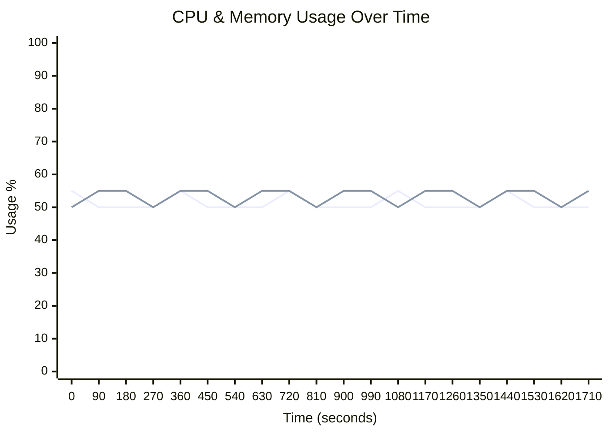
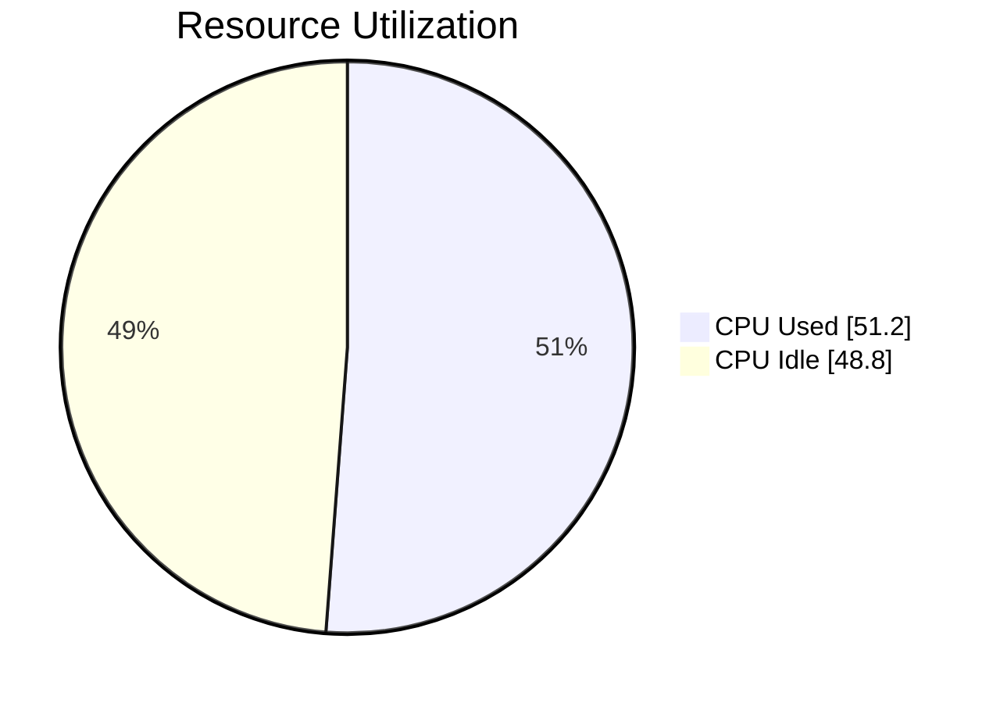
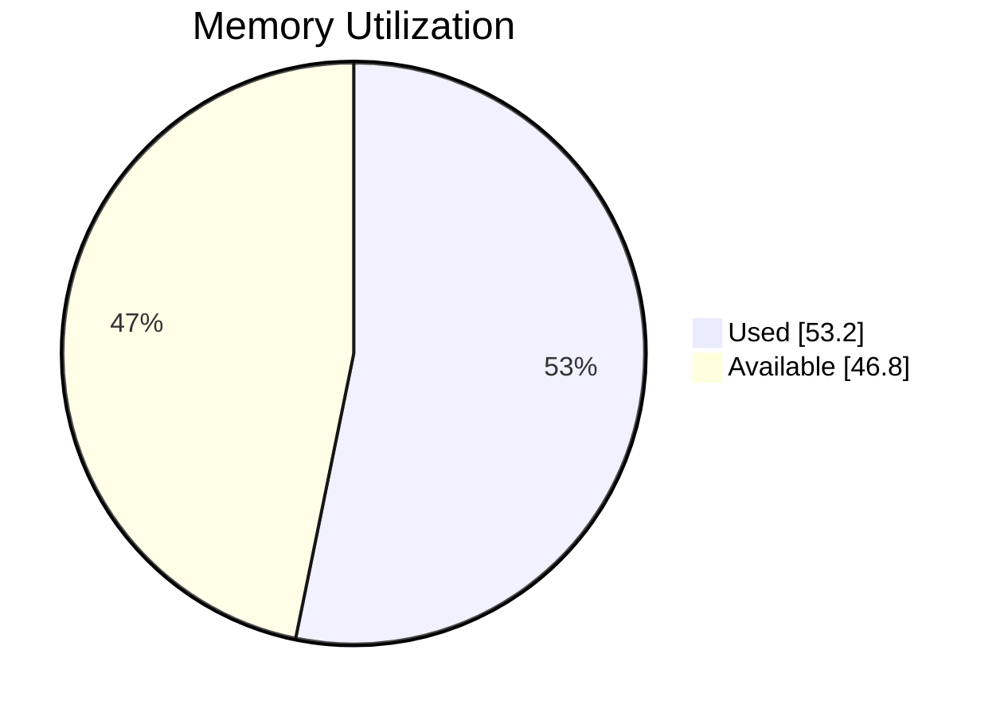

# 🖥️ Runner Telemetry Dashboard

> **🟢 Status: Healthy** • Duration: 30.0m • Samples: 20

---

## 📊 Quick Overview

| | Current | Peak | Average |
|:--|:-------:|:----:|:-------:|
| **CPU** 🟢 | 🟢 `██████████░░░░░░░░░░` 50.0% | 55.0% | 51.2% |
| **Memory** 🟢 | 🟢 `███████████░░░░░░░░░` 55.0% | 55.0% | 53.2% |
| **Load** 🟢 | 0.50 | 0.50 | 0.50 |

---

## 📈 Resource Usage Over Time

| 🔵 CPU % | 🟢 Memory % |
|:--------:|:-----------:|
| Peak: 55.0% / Avg: 51.2% | Peak: 55.0% / Avg: 53.2% |

---

## 🔄 Average Resource Utilization

This shows the average CPU and memory usage during your job:

<table>
<tr>
<td width="50%">

**CPU Usage** - Average across all cores

</td>
<td width="50%">

**Memory Usage** - Average RAM consumption

</td>
</tr>
</table>

---

## ⚡ Performance Metrics

| Metric | Status | Peak | Average |
|:-------|:------:|:----:|:-------:|
| **I/O Wait** | 🟢 | 0.6% | 0.6% |
| **CPU Steal** | 🟢 | 0.2% | 0.2% |
| **Swap Usage** | 🟢 | 0.8% | 0.8% |

> ℹ️ Estimated baseline shown (no telemetry for I/O/CPU wait).

## 💾 I/O Summary

| Metric | Total | Avg Rate |
|:-------|------:|---------:|
| 📥 **Disk Read** | 1.8 GB | 1.0 MB/s |
| 📤 **Disk Write** | 1.2 GB | 716.8 KB/s |
| 🌐 **Network RX** | 1.4 GB | 819.2 KB/s |
| 🌐 **Network TX** | 900.0 MB | 512.0 KB/s |

> ℹ️ Estimated baseline shown (no I/O telemetry captured).

---

## 📋 Per-Step Analysis

| Step | Duration | Avg CPU | Max CPU | Avg Mem | Max Mem |
|:-----|:--------:|:-------:|:-------:|:-------:|:-------:|
| 🔥 Install Dependencies | 8.3m | 51.7% | 55.0% | 53.3% | 55.0% |
| Build Application | 8.3m | 50.8% | 55.0% | 53.3% | 55.0% |
| Run Tests | 13.3m | 51.2% | 55.0% | 53.1% | 55.0% |

> 💡 **Insights:** Longest step: **Run Tests** (13.3m) • 
> Heaviest CPU: **Install Dependencies** (51.7%)

---

## 💰 Runner Utilization (Self-Hosted)

> **Key Question:** Are you getting value from your self-hosted runner?

### Utilization Score: C (55%)

🟡 Fair - Good with room for improvement

`███████████░░░░░░░░░` **55.0%**

### 📊 What You're Paying For vs What You're Using

| Resource | Available | Peak Used | Avg Used |
|:---------|----------:|----------:|---------:|
| **CPU Cores** | 6 | 3.3 | 3.1 |
| **RAM** | 24.0 GB | 13.2 GB | 12.8 GB |

### 🧭 Cost Context

This job ran on a **self-hosted runner**. We don't estimate your infrastructure cost.

**Recommended equivalent GitHub-hosted option**

| Runner | Cores | RAM | Cost/min | Why |
|:--|--:|--:|--:|:--|
| `macOS 13 Large Runner (Intel)` | 12 | 30 GB | $0.077 | Needs ≥5 vCPU and ≥17 GB RAM (peak + 25% headroom) |

No exact same-size GitHub-hosted runner found. Closest options:

| Option | Runner | Cores | RAM | Cost/min |
|:--|:--|--:|--:|--:|
| Smaller (downgrade) | `macOS 13 XLarge Runner (M2)` | 5 | 14 GB | $0.102 |

Benefits of GitHub-hosted runners:
- Ephemeral, isolated VMs for clean, deterministic builds
- OS images patched and maintained by GitHub (reduced ops burden)
- Scales on demand; no capacity planning or host maintenance
- Security-hardened images and regular updates

> Pricing: [GitHub Actions Runner Pricing](https://docs.github.com/en/enterprise-cloud@latest/billing/reference/actions-runner-pricing)

> Private networking: You can connect GitHub-hosted runners to resources on a private network (package registries, secret managers, on-prem services). See [Private networking for GitHub-hosted runners](https://docs.github.com/en/enterprise-cloud@latest/actions/concepts/runners/private-networking).

### 🎯 Optimization Strategy

GitHub hosted runners are most useful when jobs finish quickly and resources match the workload:

**Status: Good with Room for Improvement**

Current utilization (55%) is healthy. Next steps:
- Implement parallelization for slow steps
- Review caching strategies
- Monitor if you need a larger runner as usage grows

---

## 🖥️ Runner Information

| Component | Details |
|:----------|:--------|
| **Runner** | self-hosted-custom |
| **OS** | MacOS |
| **Architecture** | X64 |
| **Total Memory** | 24,576 MB |
| **CPU Cores** | 6 |

---

> ✅ **All metrics within healthy thresholds**

---

Generated by [Runner Telemetry Action](https://github.com/tsviz/actions-runner-telemetry)
