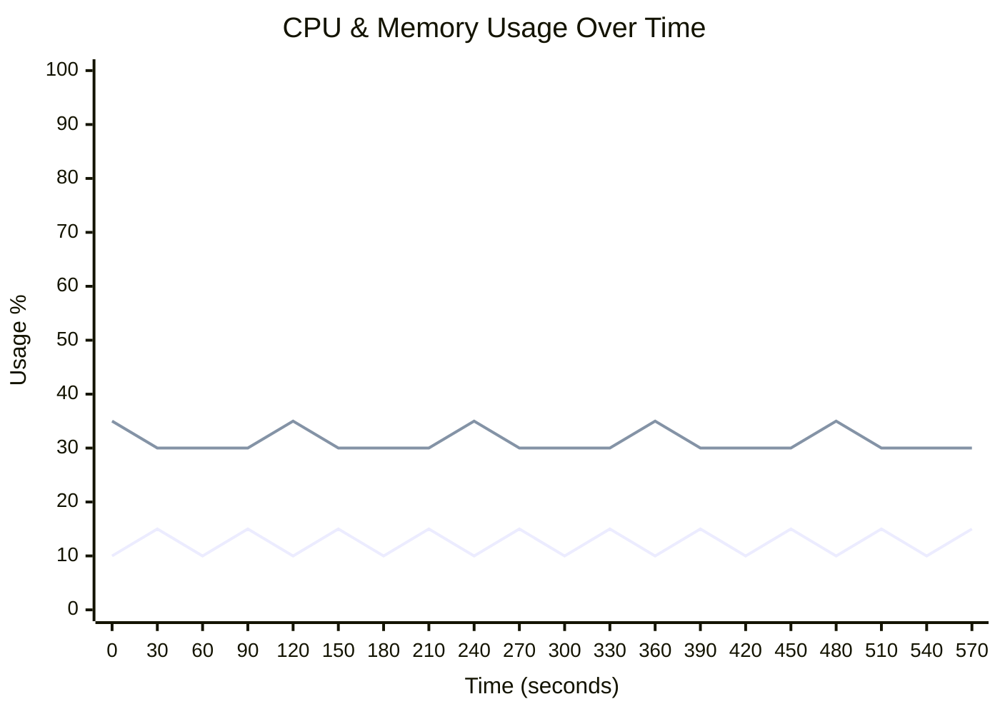
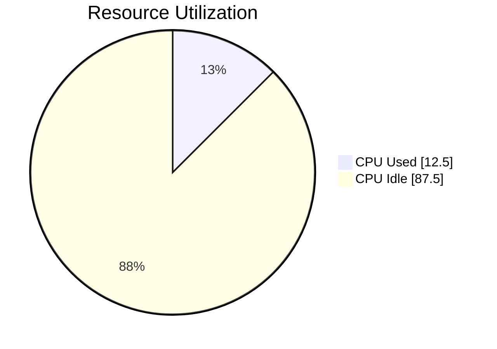
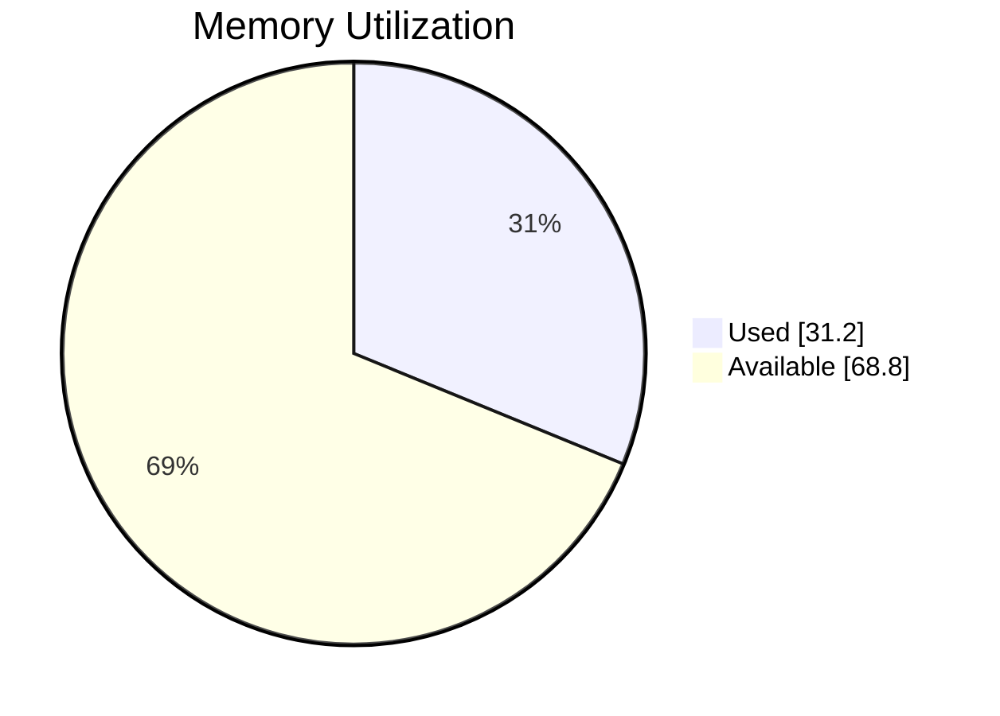

# 🖥️ Runner Telemetry Dashboard

> **🟢 Status: Healthy** • Duration: 10.0m • Samples: 20

---

## 📊 Quick Overview

| | Current | Peak | Average |
|:--|:-------:|:----:|:-------:|
| **CPU** 🟢 | 🟢 `███░░░░░░░░░░░░░░░░░` 15.0% | 15.0% | 12.5% |
| **Memory** 🟢 | 🟢 `██████░░░░░░░░░░░░░░` 30.0% | 35.0% | 31.2% |
| **Load** 🟢 | 0.50 | 0.50 | 0.50 |

---

## 📈 Resource Usage Over Time

| 🔵 CPU % | 🟢 Memory % |
|:--------:|:-----------:|
| Peak: 15.0% / Avg: 12.5% | Peak: 35.0% / Avg: 31.2% |

---

## 🔄 Average Resource Utilization

This shows the average CPU and memory usage during your job:

<table>
<tr>
<td width="50%">

**CPU Usage** - Average across all cores

</td>
<td width="50%">

**Memory Usage** - Average RAM consumption

</td>
</tr>
</table>

---

## ⚡ Performance Metrics

| Metric | Status | Peak | Average |
|:-------|:------:|:----:|:-------:|
| **I/O Wait** | 🟡 | 25.0% | 18.5% |
| **CPU Steal** | 🟢 | 0.0% | 0.0% |
| **Swap Usage** | 🟢 | 0.0% | 0.0% |

## 💾 I/O Summary

| Metric | Total | Avg Rate |
|:-------|------:|---------:|
| 📥 **Disk Read** | 1.3 GB | 2.3 MB/s |
| 📤 **Disk Write** | 686.6 MB | 1.1 MB/s |
| 🌐 **Network RX** | 0.0 B | 0.0 B/s |
| 🌐 **Network TX** | 0.0 B | 0.0 B/s |

---

## 📋 Per-Step Analysis

| Step | Duration | Avg CPU | Max CPU | Avg Mem | Max Mem |
|:-----|:--------:|:-------:|:-------:|:-------:|:-------:|
| 🔥 Install Dependencies | 2.8m | 12.5% | 15.0% | 31.7% | 35.0% |
| Build Application | 2.8m | 12.5% | 15.0% | 30.8% | 35.0% |
| Run Tests | 4.4m | 12.5% | 15.0% | 31.2% | 35.0% |

> 💡 **Insights:** Longest step: **Run Tests** (4.4m) • 
> Heaviest CPU: **Install Dependencies** (12.5%)

---

## 💰 Runner Utilization (Self-Hosted)

> **Key Question:** Are you getting value from your self-hosted runner?

### Utilization Score: D (23%)

🔴 Poor - Runner is significantly underutilized

`████░░░░░░░░░░░░░░░░` **23.0%**

### 📊 What You're Paying For vs What You're Using

| Resource | Available | Peak Used | Avg Used |
|:---------|----------:|----------:|---------:|
| **CPU Cores** | 8 | 1.2 | 1.0 |
| **RAM** | 32.0 GB | 11.2 GB | 10.0 GB |

### 🧭 Cost Context

This job ran on a **self-hosted runner**. We don't estimate your infrastructure cost.

**Recommended equivalent GitHub-hosted option**

| Runner | Cores | RAM | Cost/min | Why |
|:--|--:|--:|--:|:--|
| `Windows 4-core ARM Larger Runner` | 4 | 16 GB | $0.014 | Needs ≥2 vCPU and ≥14 GB RAM (peak + 25% headroom) |

**What if you used a comparable GitHub-hosted runner?**

| Metric | Value |
|:-------|------:|
| **Comparable Runner** | `Windows 8-core Larger Runner` |
| **Est. Per Run** | $0.42 (10 min) |
| **Est. Monthly** (10 runs/day) | $126.00 |

Benefits of GitHub-hosted runners:
- Ephemeral, isolated VMs for clean, deterministic builds
- OS images patched and maintained by GitHub (reduced ops burden)
- Scales on demand; no capacity planning or host maintenance
- Security-hardened images and regular updates

> Pricing: [GitHub Actions Runner Pricing](https://docs.github.com/en/enterprise-cloud@latest/billing/reference/actions-runner-pricing)

> Private networking: You can connect GitHub-hosted runners to resources on a private network (package registries, secret managers, on-prem services). See [Private networking for GitHub-hosted runners](https://docs.github.com/en/enterprise-cloud@latest/actions/concepts/runners/private-networking).

> ⚡ **Performance Optimization: Parallelize Slow Steps**
>
> Step **"Install Dependencies"** uses only 12% CPU for 166s.
> Consider using matrix strategy to run parallel jobs - same cost, faster completion.

### 🎯 Optimization Strategy

GitHub hosted runners are most useful when jobs finish quickly and resources match the workload:

**Priority: High Utilization Improvement**

- **Right-size workflow:** Already on the smallest tier? Focus on workflow efficiency over runner size.

- **Parallelize jobs:** Use matrix builds for independent steps  
- **Optimize caching:** Cache dependencies to reduce download time
- **Check for bottlenecks:** Identify and optimize slow sequential steps

With these optimizations, you can typically achieve 50-70% utilization and reduce costs by 30-50%.

---

## 🖥️ Runner Information

| Component | Details |
|:----------|:--------|
| **Runner** | self-hosted-custom |
| **OS** | Windows |
| **Architecture** | X64 |
| **Total Memory** | 32,768 MB |
| **CPU Cores** | 8 |

---

## 💡 Recommendations

- ⚠️ **High I/O Wait:** Disk operations may be bottlenecking performance.

---

Generated by [Runner Telemetry Action](https://github.com/tsviz/actions-runner-telemetry)
