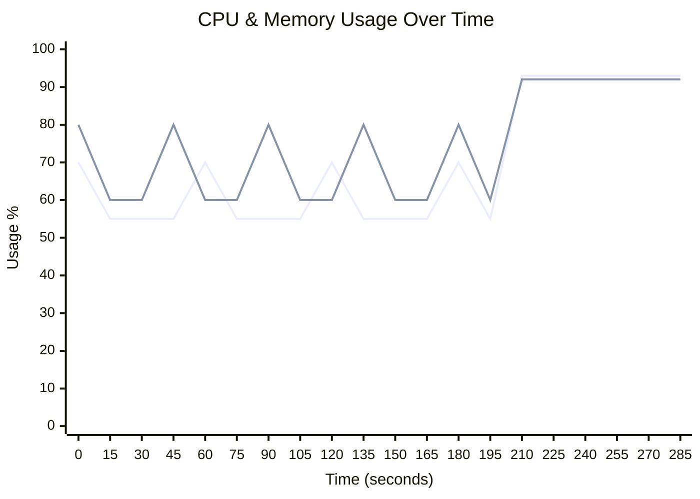
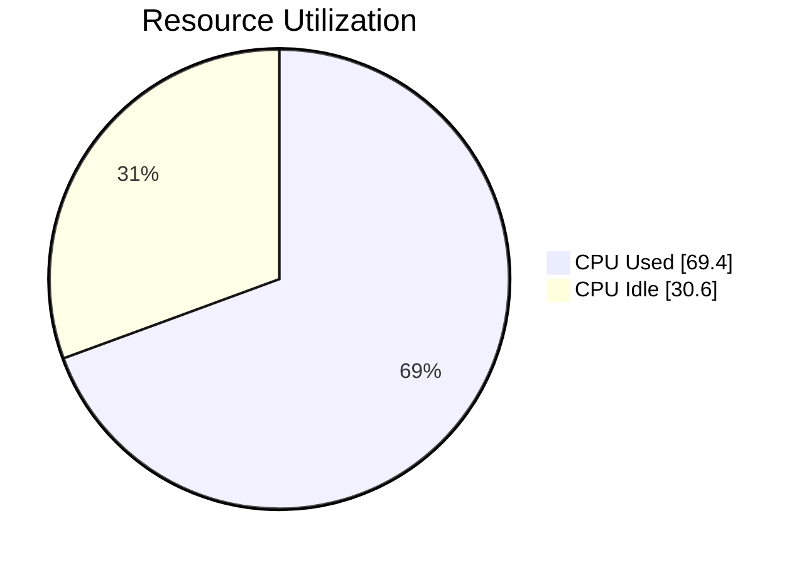
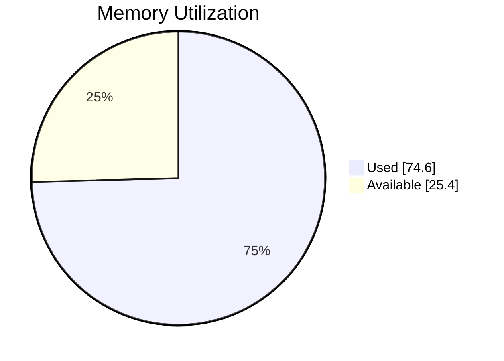

# 🖥️ Runner Telemetry Dashboard

> **🔴 Status: Needs Attention** • Duration: 5.0m • Samples: 20

---

## 📊 Quick Overview

| | Current | Peak | Average |
|:--|:-------:|:----:|:-------:|
| **CPU** 🔴 | 🔴 `██████████████████░░` 93.0% | 93.0% | 69.4% |
| **Memory** 🔴 | 🔴 `██████████████████░░` 92.0% | 92.0% | 74.6% |
| **Load** 🟢 | 0.50 | 0.50 | 0.50 |

---

## 📈 Resource Usage Over Time

| 🔵 CPU % | 🟢 Memory % |
|:--------:|:-----------:|
| Peak: 93.0% / Avg: 69.4% | Peak: 92.0% / Avg: 74.6% |

---

## 🔄 Average Resource Utilization

This shows the average CPU and memory usage during your job:

<table>
<tr>
<td width="50%">

**CPU Usage** - Average across all cores

</td>
<td width="50%">

**Memory Usage** - Average RAM consumption

</td>
</tr>
</table>

---

## ⚡ Performance Metrics

| Metric | Status | Peak | Average |
|:-------|:------:|:----:|:-------:|
| **I/O Wait** | 🟢 | 6.0% | 3.6% |
| **CPU Steal** | 🟢 | 0.0% | 0.0% |
| **Swap Usage** | 🟢 | 0.0% | 0.0% |

## 💾 I/O Summary

| Metric | Total | Avg Rate |
|:-------|------:|---------:|
| 📥 **Disk Read** | 1.5 GB | 5.1 MB/s |
| 📤 **Disk Write** | 858.3 MB | 2.9 MB/s |
| 🌐 **Network RX** | 1.0 GB | 3.6 MB/s |
| 🌐 **Network TX** | 686.6 MB | 2.3 MB/s |

---

## 📋 Per-Step Analysis

| Step | Duration | Avg CPU | Max CPU | Avg Mem | Max Mem |
|:-----|:--------:|:-------:|:-------:|:-------:|:-------:|
| Install Dependencies | 1.4m | 60.0% | 70.0% | 66.7% | 80.0% |
| Build Application | 1.4m | 57.5% | 70.0% | 66.7% | 80.0% |
| 🔥 Run Tests | 2.2m | 85.4% | 93.0% | 86.5% | 92.0% |

> 💡 **Insights:** Longest step: **Run Tests** (2.2m) • 
> Heaviest CPU: **Run Tests** (85.4%)

---

## 💰 Runner Utilization & Cost Efficiency

> **Key Question:** Are you getting maximum value from your GitHub hosted runner?

### Utilization Score: D (93%)

🔴 Poor - Job exceeds runner capacity - consider upgrading to a larger runner

`██████████████████░░` **92.6%**

### 📊 What You're Paying For vs What You're Using

| Resource | Available | Peak Used | Avg Used |
|:---------|----------:|----------:|---------:|
| **CPU Cores** | 2 | 1.9 | 1.4 |
| **RAM** | 7.0 GB | 6.4 GB | 5.2 GB |

### 💵 Cost Analysis (Jan 2026+ Pricing)

> 📖 Pricing reference: [GitHub Actions Runner Pricing](https://docs.github.com/en/enterprise-cloud@latest/billing/reference/actions-runner-pricing)

| Metric | Value |
|:-------|------:|
| **Runner Type** | `Ubuntu Standard Runner` |
| **This Run** | $0.03 (5 min) |
| **Est. Monthly** (10 runs/day) | $9.00 |

### 🎯 Optimization Strategy

GitHub hosted runners are most useful when jobs finish quickly and resources match the workload:

**Priority: Upgrade to Larger Runner ⚠️**

Your job is **straining resources** on the current runner:
- CPU peaked at **93.0%** (avg: 69.4%)
- Memory peaked at **92.0%** (avg: 74.6%)

**Recommended Runner: Linux 4-core Larger Runner (4-core, 16GB RAM)**

**Why:** Both CPU (93%) and memory (92%) are near limits.

**Expected Performance:** ~2.0x faster (upgrade from 2 to 4 cores)

**Cost Impact (accounting for faster execution):**
- Current: $0.03/run (5 min @ $0.006/min)
- Recommended: $0.03/run (est. 2.5 min @ $0.012/min)
 - **Per-run difference: +$0.00** (+0%)

**Monthly Cost Comparison** (10 runs/day, 300 runs/month):
- Current: $9.00
- Recommended: $9.00
 - **Monthly difference: +$0.00** (+0%)

**✅ Same Cost, 2.0x Faster!** Get 2.0x faster job execution at the same price.

**Hidden Value Breakdown:**
- Developer waiting time: 12.5 hours/month = **$938/month**
- Fewer timeouts: 30→3 per month = **$170/month savings** (Assuming 10% timeout rate at current utilization, ~5 min dev time per timeout)

**Total Hidden Value: ~$1107/month** in productivity and reliability improvements!

**Note:** Larger runners require a **GitHub Team or GitHub Enterprise Cloud** plan. Not available on free tier.

**How to Switch:**

To change runners, choose a label in the same OS family. Typical availability:
- Linux: standard (ubuntu-latest) and larger 4-core, 8-core sizes.
- Windows: standard (windows-latest) and larger 4-core, 8-core sizes.
- macOS: standard (macos-latest), larger (e.g., 12‑core), and xlarge options.

For setup instructions, see: [GitHub Actions - Manage Larger Runners](https://docs.github.com/en/enterprise-cloud@latest/actions/how-tos/manage-runners/larger-runners/manage-larger-runners)

For pricing details, see: [GitHub Actions Runner Pricing](https://docs.github.com/en/enterprise-cloud@latest/billing/reference/actions-runner-pricing)

---

## 🖥️ Runner Information

| Component | Details |
|:----------|:--------|
| **Runner** | ubuntu-latest |
| **OS** | Linux |
| **Architecture** | X64 |
| **Total Memory** | 7,168 MB |
| **CPU Cores** | 2 |

---

## 💡 Recommendations

- ⚠️ **High CPU Usage:** Peak reached 93.0%. Consider using a larger runner or optimizing compute-heavy operations.
- ⚠️ **High Memory Usage:** Peak reached 92.0%. Watch for OOM issues or consider runners with more RAM.

---

Generated by [Runner Telemetry Action](https://github.com/tsviz/actions-runner-telemetry)
