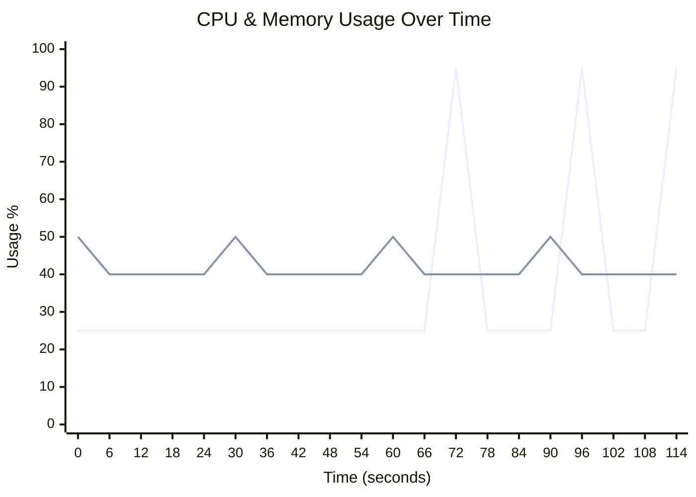
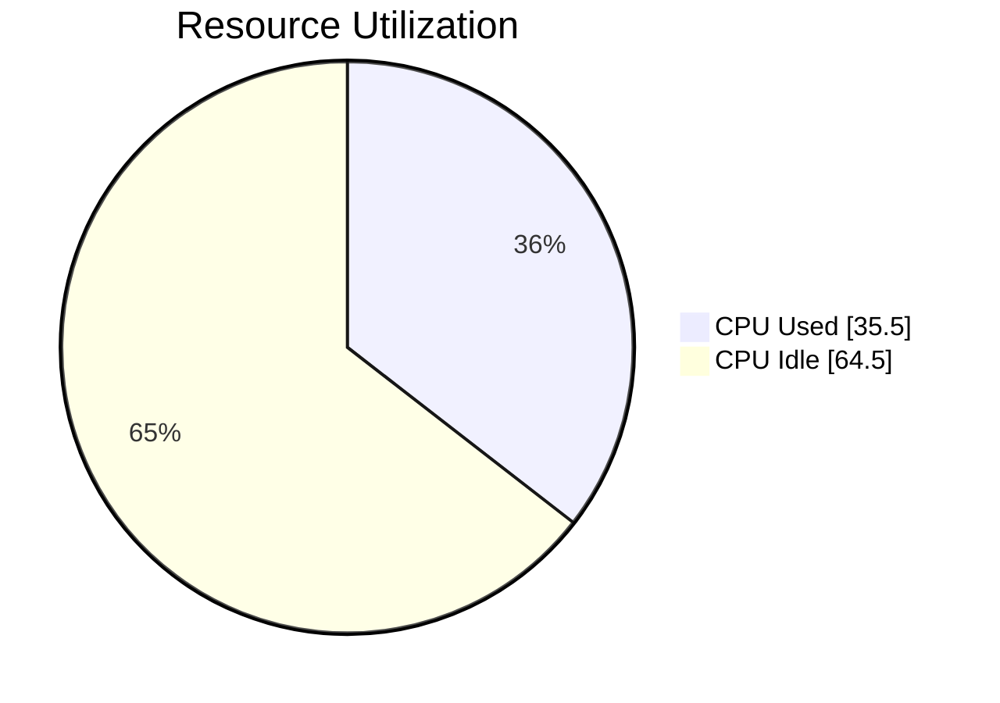
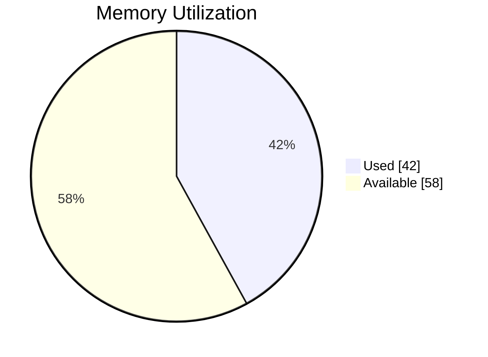

# 🖥️ Runner Telemetry Dashboard

> **🔴 Status: Needs Attention** • Duration: 2.0m • Samples: 20

---

## 📊 Quick Overview

| | Current | Peak | Average |
|:--|:-------:|:----:|:-------:|
| **CPU** 🔴 | 🔴 `███████████████████░` 95.0% | 95.0% | 35.5% |
| **Memory** 🟢 | 🟢 `████████░░░░░░░░░░░░` 40.0% | 50.0% | 42.0% |
| **Load** 🟢 | 0.50 | 0.50 | 0.50 |

---

## 📈 Resource Usage Over Time

| 🔵 CPU % | 🟢 Memory % |
|:--------:|:-----------:|
| Peak: 95.0% / Avg: 35.5% | Peak: 50.0% / Avg: 42.0% |

---

## 🔄 Average Resource Utilization

This shows the average CPU and memory usage during your job:

<table>
<tr>
<td width="50%">

**CPU Usage** - Average across all cores

</td>
<td width="50%">

**Memory Usage** - Average RAM consumption

</td>
</tr>
</table>

---

## ⚡ Performance Metrics

| Metric | Status | Peak | Average |
|:-------|:------:|:----:|:-------:|
| **I/O Wait** | 🟢 | 0.6% | 0.6% |
| **CPU Steal** | 🟢 | 0.2% | 0.2% |
| **Swap Usage** | 🟢 | 0.8% | 0.8% |

> ℹ️ Estimated baseline shown (no telemetry for I/O/CPU wait).

## 💾 I/O Summary

| Metric | Total | Avg Rate |
|:-------|------:|---------:|
| 📥 **Disk Read** | 120.0 MB | 1.0 MB/s |
| 📤 **Disk Write** | 84.0 MB | 716.8 KB/s |
| 🌐 **Network RX** | 96.0 MB | 819.2 KB/s |
| 🌐 **Network TX** | 60.0 MB | 512.0 KB/s |

> ℹ️ Estimated baseline shown (no I/O telemetry captured).

---

## 📋 Per-Step Analysis

| Step | Duration | Avg CPU | Max CPU | Avg Mem | Max Mem |
|:-----|:--------:|:-------:|:-------:|:-------:|:-------:|
| Install Dependencies | 33.0s | 25.0% | 25.0% | 43.3% | 50.0% |
| Build Application | 33.0s | 25.0% | 25.0% | 41.7% | 50.0% |
| 🔥 Run Tests | 53.0s | 48.3% | 95.0% | 41.1% | 50.0% |

> 💡 **Insights:** Longest step: **Run Tests** (53.0s) • 
> Heaviest CPU: **Run Tests** (48.3%)

---

## 💰 Runner Utilization & Performance

> **Key Question:** Are you getting fast feedback from your GitHub-hosted runner?

### Utilization Score: C (77%)

🟡 Fair - Job is straining resources - consider upgrading to a larger runner

`███████████████░░░░░` **77.0%**

### 📊 What You're Paying For vs What You're Using

| Resource | Available | Peak Used | Avg Used |
|:---------|----------:|----------:|---------:|
| **CPU Cores** | 4 | 3.8 | 1.4 |
| **RAM** | 16.0 GB | 8.0 GB | 6.7 GB |

### 🎉 Free Runner

This job ran on `Ubuntu Standard Runner` at **no cost** (standard GitHub-hosted runner on public repository).

### 🎯 Optimization Strategy

GitHub hosted runners are most useful when jobs finish quickly and resources match the workload:

**Priority: Upgrade to Larger Runner ⚠️**

Your job is **straining resources** on the current runner:
- CPU peaked at **95.0%** (avg: 35.5%)
- Memory peaked at **50.0%** (avg: 42.0%)

**Recommended Runner: Linux 4-core Larger Runner (4-core, 16GB RAM)**

**Why:** CPU maxed out at 95%.

**Expected Performance:** ~2.0x faster

**Cost Impact (accounting for faster execution):**
- **Current: FREE** (2 min @ $0.00/min on public repository)
- **Recommended: $0.012/run** (est. 1.0 min @ $0.012/min)
- **Additional cost per run: +$0.012**

**Monthly Cost Comparison** (if you run 10 times/day, 300 runs/month):
- **Current: FREE** ($0/month on free tier)
- **Recommended: $3.60/month** ($0.012/run × 300 runs)

⚠️ **Important Trade-off:** You're currently using GitHub's free runners available to public repositories. Upgrading to a larger runner means incurring costs, but you gain significant speed and reliability benefits listed above.

**💡 Performance Improvement Available:** 2.0x faster execution on a paid larger runner.

**Developer productivity value:** 5.0 hours/month saved = **$375/month**

**Reliability improvements:** Fewer timeouts saves ~$338/month (Assuming 20% timeout rate at current utilization, ~5 min dev time per timeout)

**Total hidden value: ~$713/month** in productivity and reliability.

**Note:** You're currently using a free runner (public repo benefit). This recommendation requires switching to a paid larger runner.

**Note:** Larger runners require a **GitHub Team or GitHub Enterprise Cloud** plan. Not available on free tier.

**How to Switch:**

To change runners, choose a label in the same OS family. Typical availability:
- Linux: standard (ubuntu-latest) and larger 4-core, 8-core sizes.
- Windows: standard (windows-latest) and larger 4-core, 8-core sizes.
- macOS: standard (macos-latest), larger (e.g., 12‑core), and xlarge options.

For setup instructions, see: [GitHub Actions - Manage Larger Runners](https://docs.github.com/en/enterprise-cloud@latest/actions/how-tos/manage-runners/larger-runners/manage-larger-runners)

For pricing details, see: [GitHub Actions Runner Pricing](https://docs.github.com/en/enterprise-cloud@latest/billing/reference/actions-runner-pricing)

---

## 🖥️ Runner Information

| Component | Details |
|:----------|:--------|
| **Runner** | ubuntu-latest |
| **OS** | Linux |
| **Architecture** | X64 |
| **Total Memory** | 16,384 MB |
| **CPU Cores** | 4 |

---

## 💡 Recommendations

- ⚠️ **High CPU Usage:** Peak reached 95.0%. Consider using a larger runner or optimizing compute-heavy operations.

---

Generated by [Runner Telemetry Action](https://github.com/tsviz/actions-runner-telemetry)
