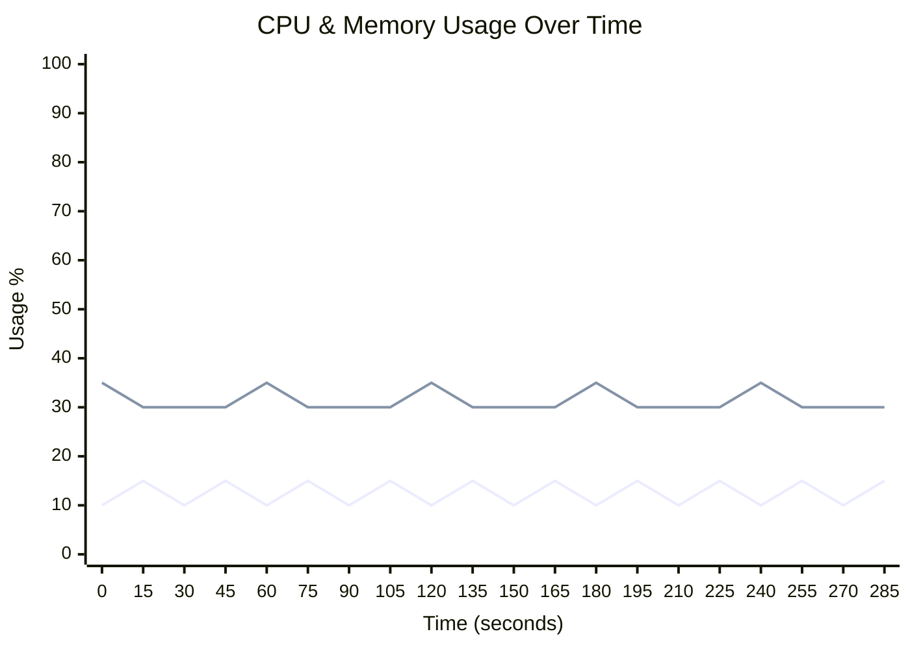
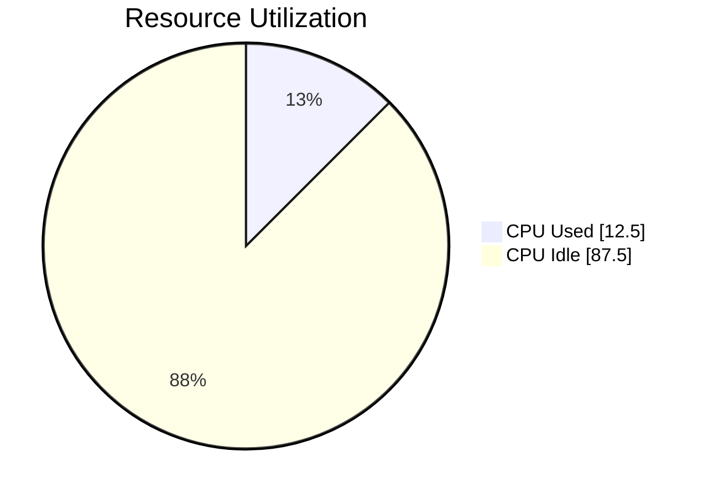
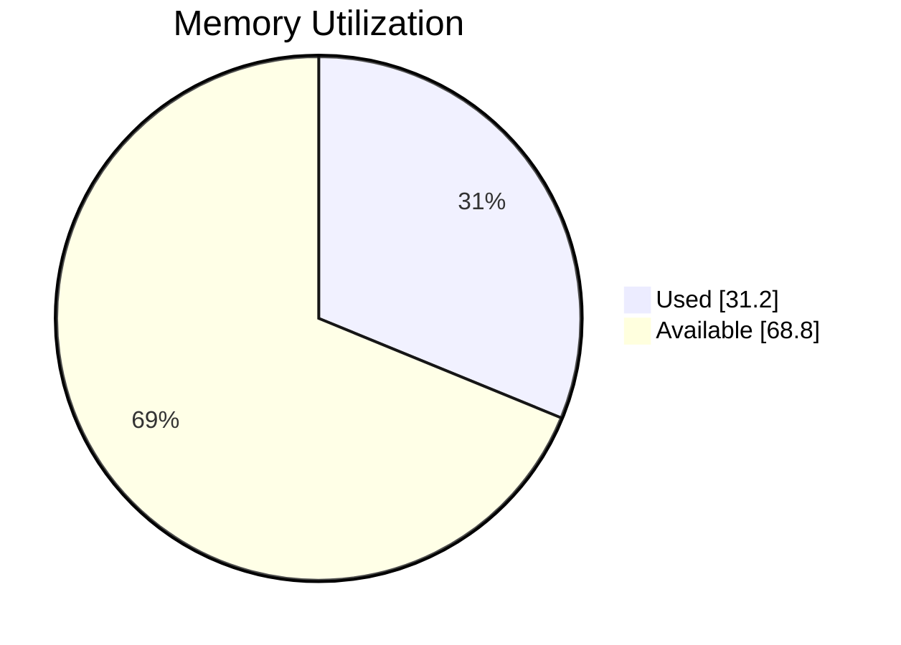

# 🖥️ Runner Telemetry Dashboard

> **🟢 Status: Healthy** • Duration: 5.0m • Samples: 20

---

## 📊 Quick Overview

| | Current | Peak | Average |
|:--|:-------:|:----:|:-------:|
| **CPU** 🟢 | 🟢 `███░░░░░░░░░░░░░░░░░` 15.0% | 15.0% | 12.5% |
| **Memory** 🟢 | 🟢 `██████░░░░░░░░░░░░░░` 30.0% | 35.0% | 31.2% |
| **Load** 🟢 | 0.50 | 0.50 | 0.50 |

---

## 📈 Resource Usage Over Time

| 🔵 CPU % | 🟢 Memory % |
|:--------:|:-----------:|
| Peak: 15.0% / Avg: 12.5% | Peak: 35.0% / Avg: 31.2% |

---

## 🔄 Average Resource Utilization

This shows the average CPU and memory usage during your job:

<table>
<tr>
<td width="50%">

**CPU Usage** - Average across all cores

</td>
<td width="50%">

**Memory Usage** - Average RAM consumption

</td>
</tr>
</table>

---

## ⚡ Performance Metrics

| Metric | Status | Peak | Average |
|:-------|:------:|:----:|:-------:|
| **I/O Wait** | 🟡 | 25.0% | 18.5% |
| **CPU Steal** | 🟢 | 0.0% | 0.0% |
| **Swap Usage** | 🟢 | 0.0% | 0.0% |

## 💾 I/O Summary

| Metric | Total | Avg Rate |
|:-------|------:|---------:|
| 📥 **Disk Read** | 686.6 MB | 2.3 MB/s |
| 📤 **Disk Write** | 343.3 MB | 1.1 MB/s |
| 🌐 **Network RX** | 0.0 B | 0.0 B/s |
| 🌐 **Network TX** | 0.0 B | 0.0 B/s |

---

## 📋 Per-Step Analysis

| Step | Duration | Avg CPU | Max CPU | Avg Mem | Max Mem |
|:-----|:--------:|:-------:|:-------:|:-------:|:-------:|
| 🔥 Install Dependencies | 1.4m | 12.5% | 15.0% | 31.7% | 35.0% |
| Build Application | 1.4m | 12.5% | 15.0% | 30.8% | 35.0% |
| Run Tests | 2.2m | 12.5% | 15.0% | 31.2% | 35.0% |

> 💡 **Insights:** Longest step: **Run Tests** (2.2m) • 
> Heaviest CPU: **Install Dependencies** (12.5%)

---

## 💰 Runner Utilization & Cost Efficiency

> **Key Question:** Are you getting maximum value from your GitHub hosted runner?

### Utilization Score: D (23%)

🔴 Poor - Runner is significantly underutilized

`████░░░░░░░░░░░░░░░░` **23.0%**

### 📊 What You're Paying For vs What You're Using

| Resource | Available | Peak Used | Avg Used |
|:---------|----------:|----------:|---------:|
| **CPU Cores** | 2 | 0.3 | 0.2 |
| **RAM** | 7.0 GB | 2.4 GB | 2.2 GB |

### 💵 Cost Analysis (Jan 2026+ Pricing)

> 📖 Pricing reference: [GitHub Actions Runner Pricing](https://docs.github.com/en/enterprise-cloud@latest/billing/reference/actions-runner-pricing)

| Metric | Value |
|:-------|------:|
| **Runner Type** | `Windows Standard Runner` |
| **This Run** | $0.05 (5 min) |
| **Est. Monthly** (10 runs/day) | $15.00 |

> ⚡ **Performance Optimization: Parallelize Slow Steps**
>
> Step **"Install Dependencies"** uses only 12% CPU for 83s.
> Consider using matrix strategy to run parallel jobs - same cost, faster completion.

### 🎯 Optimization Strategy

GitHub hosted runners are most useful when jobs finish quickly and resources match the workload:

**Priority: High Utilization Improvement**

- **Right-size workflow:** Already on the smallest tier? Focus on workflow efficiency over runner size.

- **Parallelize jobs:** Use matrix builds for independent steps  
- **Optimize caching:** Cache dependencies to reduce download time
- **Check for bottlenecks:** Identify and optimize slow sequential steps

With these optimizations, you can typically achieve 50-70% utilization and reduce costs by 30-50%.

---

## 🖥️ Runner Information

| Component | Details |
|:----------|:--------|
| **Runner** | windows-latest |
| **OS** | Windows |
| **Architecture** | X64 |
| **Total Memory** | 7,168 MB |
| **CPU Cores** | 2 |

---

## 💡 Recommendations

- ⚠️ **High I/O Wait:** Disk operations may be bottlenecking performance.

---

Generated by [Runner Telemetry Action](https://github.com/tsviz/actions-runner-telemetry)
