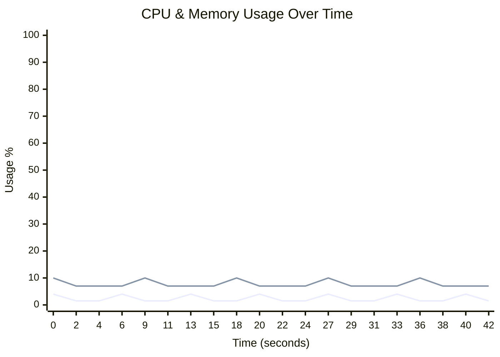
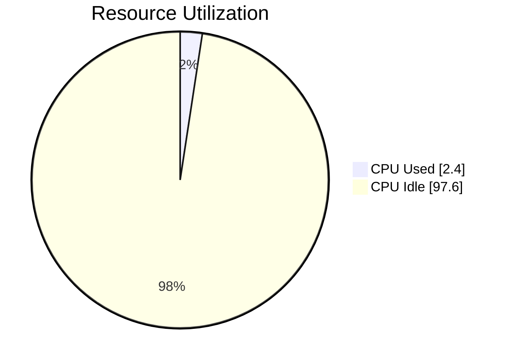
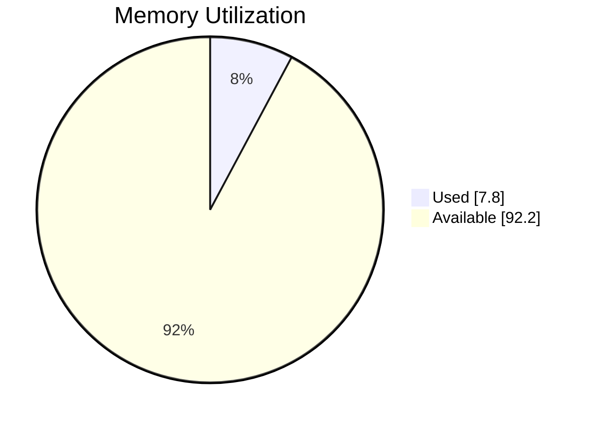

# 🖥️ Runner Telemetry Dashboard

> **🟢 Status: Healthy** • Duration: 45.0s • Samples: 20

---

## 📊 Quick Overview

| | Current | Peak | Average |
|:--|:-------:|:----:|:-------:|
| **CPU** 🟢 | 🟢 `░░░░░░░░░░░░░░░░░░░░` 1.5% | 4.0% | 2.4% |
| **Memory** 🟢 | 🟢 `█░░░░░░░░░░░░░░░░░░░` 7.0% | 10.0% | 7.8% |
| **Load** 🟢 | 0.50 | 0.50 | 0.50 |

---

## 📈 Resource Usage Over Time

| 🔵 CPU % | 🟢 Memory % |
|:--------:|:-----------:|
| Peak: 4.0% / Avg: 2.4% | Peak: 10.0% / Avg: 7.8% |

---

## 🔄 Average Resource Utilization

This shows the average CPU and memory usage during your job:

<table>
<tr>
<td width="50%">

**CPU Usage** - Average across all cores

</td>
<td width="50%">

**Memory Usage** - Average RAM consumption

</td>
</tr>
</table>

---

## ⚡ Performance Metrics

| Metric | Status | Peak | Average |
|:-------|:------:|:----:|:-------:|
| **I/O Wait** | 🟢 | 0.6% | 0.6% |
| **CPU Steal** | 🟢 | 0.2% | 0.2% |
| **Swap Usage** | 🟢 | 0.8% | 0.8% |

> ℹ️ Estimated baseline shown (no telemetry for I/O/CPU wait).

## 💾 I/O Summary

| Metric | Total | Avg Rate |
|:-------|------:|---------:|
| 📥 **Disk Read** | 45.0 MB | 1.0 MB/s |
| 📤 **Disk Write** | 31.5 MB | 716.8 KB/s |
| 🌐 **Network RX** | 36.0 MB | 819.2 KB/s |
| 🌐 **Network TX** | 22.5 MB | 512.0 KB/s |

> ℹ️ Estimated baseline shown (no I/O telemetry captured).

---

## 📋 Per-Step Analysis

| Step | Duration | Avg CPU | Max CPU | Avg Mem | Max Mem |
|:-----|:--------:|:-------:|:-------:|:-------:|:-------:|
| Install Dependencies | 12.0s | 2.3% | 4.0% | 8.0% | 10.0% |
| 🔥 Build Application | 12.0s | 2.5% | 4.0% | 7.6% | 10.0% |
| Run Tests | 20.0s | 2.3% | 4.0% | 7.7% | 10.0% |

> 💡 **Insights:** Longest step: **Run Tests** (20.0s) • 
> Heaviest CPU: **Build Application** (2.5%)

---

## 💰 Runner Utilization & Performance

> **Key Question:** Are you getting fast feedback from your GitHub-hosted runner?

### Utilization Score: D (6%)

🔴 Poor - Runner is significantly underutilized

`█░░░░░░░░░░░░░░░░░░░` **6.4%**

### 📊 What You're Paying For vs What You're Using

| Resource | Available | Peak Used | Avg Used |
|:---------|----------:|----------:|---------:|
| **CPU Cores** | 4 | 0.2 | 0.1 |
| **RAM** | 16.0 GB | 1.6 GB | 1.2 GB |

### 🎉 Free Runner

This job ran on `Windows Standard Runner` at **no cost** (standard GitHub-hosted runner on public repository).

### ⏳ Idle Time Detected

**45s (100%)** of job time had minimal CPU activity.

> ℹ️ **Note:** This job is short (45.0s). Utilization and idle metrics can be skewed on brief runs.

---

## 🖥️ Runner Information

| Component | Details |
|:----------|:--------|
| **Runner** | windows-latest |
| **OS** | Windows |
| **Architecture** | X64 |
| **Total Memory** | 16,384 MB |
| **CPU Cores** | 4 |

---

> ✅ **All metrics within healthy thresholds**

---

Generated by [Runner Telemetry Action](https://github.com/tsviz/actions-runner-telemetry)
